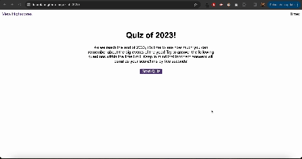

# Quiz of 2023
## Description
This application is a multiple choice quiz about some key events that happened in 2023. It's made by a UK-based person so will likely be easier for those in the UK! 

The application features 5 questions which the user needs to answer within the 60 second time limit. The user answers each question in turn, and is told immediately whether their answer is correct or not. If the answer is incorrect, 
they will lose 5 seconds from the timer. 

The user's score is determined based on how much time they have left upon answering all the questions (or as many as they could within the time limit). 

The user can input their initials and save their highscore. They can then view the highscores page, which displays all high scores in descending order. The user can clear highscores from local storage and the page if they wish.

[Deployed Application](https://kauralane.github.io/quiz-of-2023/)

## Installation
None.

## Usage
This application is a set of 2 HTML pages, the second of which can be accessed via a link, or the user will be taken to it automatically upon submitting their score. It only requires a cursor. 

## Credits
The main resources I used were: W3Schools, GreatStack YouTube channel, MDN, geeksforgeeks.org

## License
Licensed under the [MIT License](LICENSE).